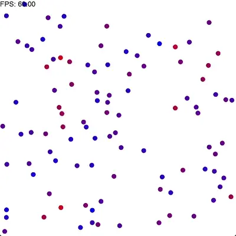

# Modern C++ sandbox

I use this project to learn and test modern C++ features introduced in recent standards.
My last experience was with C++03 and there are tons of changes. Hence I created this small project to try the new things.

# game-scene

Simple sandbox app to test C++ with SDL2. Displays a set of circles, a rectangle together with FPS label.

# Collision System

A bit more complex example. It creates a system of moving particles and simulates their movement based on elastic collisions.
All particles are 2d circles and collisions are elastic. 

If called with no arguments, it creates a system of 100 equal mass and size particles with random speed. Using arguments, you can set either a number of random particles or load the more complex system from a file.

When loaded from a file, you can set the mass, size, color and speed of each particle allowing to simulate e.g. various physical systems.
See examples in [data](./data) folder.

## Implementation

Implementation and examples are based on [Java version](https://algs4.cs.princeton.edu/code/edu/princeton/cs/algs4/CollisionSystem.java.html) from the great [Algorithms book](https://algs4.cs.princeton.edu/home/) by Robert Sedgewick and Kevin Wayne. I also highly recommend the [Algorithms, Part I](https://www.coursera.org/learn/algorithms-part1) course based on this book. I completed it in 2016 and really enjoyed every lecture and assignment of it.

It uses same base building blocks from game scene, but also added calculation of collisions based on priority queue approach.

# Tools

## Build

CMake >=3.12 and some modern C++ compiler is required. I build & run the project using Microsoft Visual Studio Community 2022,
please let me know if there are any issues on other platforms (PRs are welcome).

## Depenedncies Management

To manage dependencies for the build [vcpkg](https://vcpkg.io) comes handy. At least it's the most close 
to [Apache Maven](https://maven.apache.org/) dependency manager I can find.

# Dependencies

## SDL2

Cross-platform [graphis library](https://www.libsdl.org/) with plain C interface, that makes it easier to use
(and allows to learn couple of tricks, e.g. see [sdlwrappers.h](./sdlwrappers.h)).
In addition to main library, I use [SDL2_image](./https://github.com/libsdl-org/SDL_image) to read images and [SDL2_ttf](https://github.com/libsdl-org/SDL_ttf) to render fonts.

## CLI11

> [CLI11](https://github.com/CLIUtils/CLI11) is a command line parser for C++11 and beyond that provides a rich feature set with a simple and intuitive interface.

Used as standalone header [CLI11.hpp](./CLI11.hpp).

## {fmt}

> [{fmt}](https://github.com/fmtlib/fmt) is an open-source formatting library providing a fast and safe alternative to C stdio and C++ iostreams.

Used to more conveniently format text.
